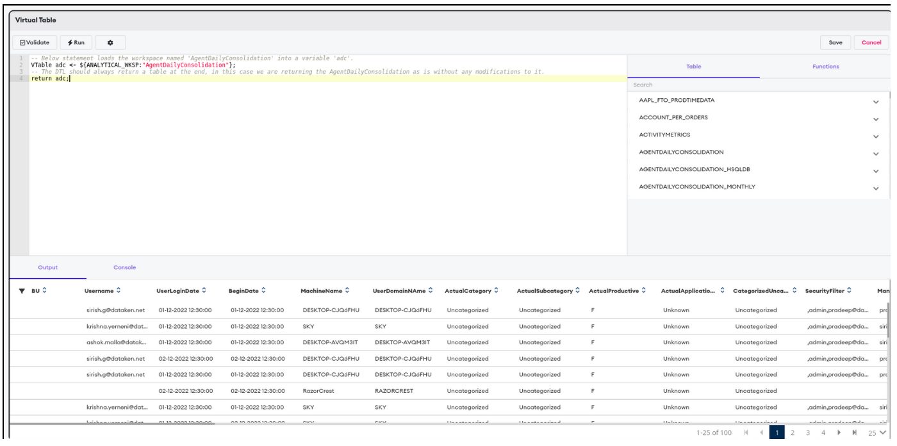
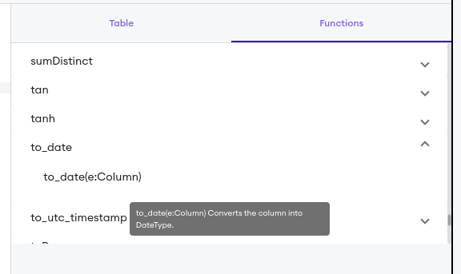

## DTL Training Guide

#### Table of Content
- What is DTL ?
- Places where DTLs are used in the Dataken platform
- Data model in the Dataken platform
- Important tables in the platform and their description
- How to write DTLs in the Dataken platform
  - Loading the workspaces
  - Selecting required columns
  - Built-in functions
  - Aggregations and Group By clause
  - Order By clause
  - Filtering the data using where clause
  - Joining multiple tables.
  - Case statements
- Advanced topics
  - Window functions
  - Topics not covered here
- Exercises
  - Exercise 1
  - Exercise 2
  - Exercise 3
  - Exercise 4
  - Exercise 5

### What is DTL?
- DTL (Dataken's Transformation Language) is a custom SQL-like language built at Dataken to transform existing datasets.
- DTL is mainly used for:
    - Joining two or more datasets (datasets/workspaces/tables are the same and will be used interchangeably) to create a new dataset.
    - Add new columns by transforming data from the existing columns.
    - Consolidate the data from one dataset and transform it into another dataset.
    - To handle more complicated use cases like grouping of data and applying window functions like rank etc over the data
    - And many more.

### Places where DTLs are used in the Dataken platform

- In the Dataken platform the DTLs are written mainly in the "Intelligence > Workspaces" and "Intelligence > Transform" sections.
- DTLs in workspaces are written to join two or more input datasources and to transform the data after joining them.
- DTLs in the Transform section are written to enhance the existing workspaces to add more columns, or to aggregate the data from the workspaces.
    - These DTLs which are written in the Transform section will show up the Data model section of the Reports page.
- Other places where DTLs are used in the platform are to create new columns in the runtime while configuring the reports.

### Data model in the Dataken platform

- The data model in Dataken platform refers to the list of workspaces (tables in the mysql database) and virtual tables.
- These tables and virtual tables are represented as a hierarchy with names of the columns under the names of the tables.
- The below image shows the data model in the Dataken platform.
  

### Important tables in the platform and their description

- Below are the tables that are commonly used in the DTLs and their high level description. 

| Feature                       | Table name | Description                                                                                                                                                                                                                                                                                                                                                                                                                                                                                                                                                                                                                                                                                                                                                                                                                                                                                                                                                                                                                                                                                                                                                                                                                                                                                                                                                                                                                                                                                                                                                                                                                                                                                                                                                                                                                                             |
|-------------------------------|-----------|---------------------------------------------------------------------------------------------------------------------------------------------------------------------------------------------------------------------------------------------------------------------------------------------------------------------------------------------------------------------------------------------------------------------------------------------------------------------------------------------------------------------------------------------------------------------------------------------------------------------------------------------------------------------------------------------------------------------------------------------------------------------------------------------------------------------------------------------------------------------------------------------------------------------------------------------------------------------------------------------------------------------------------------------------------------------------------------------------------------------------------------------------------------------------------------------------------------------------------------------------------------------------------------------------------------------------------------------------------------------------------------------------------------------------------------------------------------------------------------------------------------------------------------------------------------------------------------------------------------------------------------------------------------------------------------------------------------------------------------------------------------------------------------------------------------------------------------------------------|
| Productivity, Gamification, Wellness | Employee | The metadata of the users where the agent is installed. This table contains the EmployeeID, Username, FirstName LastName and other fields which are related to the user. <br/>The SecurityFilter and ManagerFilter fields in this table represent the hierarchy of the users.                                                                                                                                                                                                                                                                                                                                                                                                                                                                                                                                                                                                                                                                                                                                                                                                                                                                                                                                                                                                                                                                                                                                                                                                                                                                                                                                                                                                                                                                                                                                                                           |
| Productivity                  |vtEmp_ActMetrics_App| Stores the raw prodcutivty data sent from the agent. Below are the important columns in this table <br/><ul><li>UserAccountName: The username of the desktop where the agent is installed and is sending the data</li><li>ProductName: The name of the program (Ex: chrome.exe, Excel.exe) that the user is currently using</li><li>WindowTitle: The title of the window that the user is currently working on (Active window)</li><li>BeginTimeUtc: The time in UTC timezone when the user starting using the current active window</li><li>EndTimeUtc: The time in UTC timezone when the user has switched of closed the current active window</li><li>TotalTime: The time in seconds user spent in the captured active window</li><li>IdleTime: The time in seconds user was idle in the captured active window</li><li>ActiveTimeSec: The time in seconds user spent in the captured window actively</li><li>KeyPressCount: The number of times user has pressed the keys in the keyboard in the captured active window<li>MouseMoveCount: The number of mouse moves user has performed in the captured active window</li><li>The fields _EmployeeID,CompanyName,Username,FirstName,LastName,Role,Vertical,BU,DeviceModel,DeviceID,SecurityFilter,ManagerFilter,EmployeeAlias_ are fetched from the Employee table by joining the UserAccountName and the EmployeeID field of Employee table</li><li>The fields _productive,BU_Productivity,Category,BU_Category,SubCategory,BU_SubCategory,GameGrouping,BU_GameGrouping,GamePoints_Hours,<br/>BU_GamePoints_Hours,applicationName,BU_ApplicationName,BU_BusinessUnit,BU_Title,BU_Tool,ActualProductive,ActualCategory,<br/>ActualSubcategory,ActualGameGrouping,ActualGamePoints_Hours,ActualApplicationName_ are populated by the App rule executor using the app categorization rules.</li></ul> |
| Productivity | AgentDailyConsolidation | This tables holds the data aggregated from the _vtEmp_ActMetrics_App_ table. The aggregation is based on the User, Date, Category, Productive nature of the captured window etc. The time related fields like TotalTime, ActiveTime, IdleTime are aggregated using the _SUM_ function and fields like _ProdTotalHours,ProdActiveHours,ProdIdleHours,NonProdTotalHours,NonProdActiveHours,NonProdIdleHours,NonProdNonCatTotalHours,NonProdNonCatActiveHours,NonProdNonCatIdleHours_ are populated based on the productive / non productive nature of the captured window.                                                                                                                                                                                                                                                                                                                                                                                                                                                                                                                                                                                                                                                                                                                                                                                                                                                                                                                                                                                                                                                                                                                                                                                                                                                                                |
| Gamification | GameInstance | Stores the data related to the games played by the users. As part of the Gamification feature, multiple types of games can be displayed to the user via the agent. Once the user plays these games, the data such as Username, StartTime, EndTime, points, GameName, GameType etc are captured in this table. This table also has the Employee metadata such as EmployeeID, SecurityFilter, ManagerFilter                                                                                                                                                                                                                                                                                                                                                                                                                                                                                                                                                                                                                                                                                                                                                                                                                                                                                                                                                                                                                                                                                                                                                                                                                                                                                                                                                                                                                                               |
| Wellness | WellnessMetrics | Stores the data related to the wellness & motivational message displayed to the user. Contains fields such as Username, displayTime, closeTime, HabitName etc.                                                                                                                                                                                                                                                                                                                                                                                                                                                                                                                                                                                                                                                                                                                                                                                                                                                                                                                                                                                                                                                                                                                                                                                                                                                                                                                                                                                                                                                                                                                                                                                                                                                                                          |
| MicroLearning | LearningMetrics | Stores the data related to the learning videos watched by the user. These learning videos are displayed to the user via agent and the details such as Username, VideoWatched, VideoWatchTime etc are captured in this table.                                                                                                                                                                                                                                                                                                                                                                                                                                                                                                                                                                                                                                                                                                                                                                                                                                                                                                                                                                                                                                                                                                                                                                                                                                                                                                                                                                                                                                                                                                                                                                                                                            |

### How to write DTLs in the Dataken platform

- The Dataken platform supports DTLs in multiple features. The DTL is mostly used to created virtual tables, 
  as the name suggests the virtual tables exists only at runtime in the memory and are based on the physical MySQL
  tables created by the workspaces.
- The virtual tables are created using the platform's Intelligence > Transform menu item and the outline of this page is given below
  
- Below sections describe the basic syntax of writing the DTLs.
- Also, most of the DTL is very close to standard SQL, so if SQL is understood then 90% of DTL is already understood.

#### Loading the workspaces

- The initial step in writing DTL is to load a workspace. To load a workspace use the below statement.
```sql
-- Below statement loads the workspace named 'AgentDailyConsolidation' into a variable 'adc'.
VTable adc <- ${ANALYTICAL_WKSP:"AgentDailyConsolidation"};
-- The DTL should always return a table at the end, in this case we are returning the AgentDailyConsolidation as is without any modifications to it.
return adc;
```
- The output of the above statement is shown below.
  

#### Selecting required columns

- Once the table is loaded then required columns can be selected using the _SELECT_ query as shown below.
```sql
-- Below statement loads the workspace named 'vtEmp_ActMetrics_App' into a variable 'prodMetrics'.
VTable prodMetrics <- ${ANALYTICAL_WKSP:"vtEmp_ActMetrics_App"};

-- In the below statement we are selecting only the required columns from the table vtEmp_ActMetrics_App
prodMetrics <- select UserAccountName, ProductName, WindowTitle, BeginTimeUtc, EndTimeUtc, TotalTime, ActiveTimeSec, IdleTime from prodMetrics;

-- The DTL should always return a table at the end, in this case we are returning the vtEmp_ActMetrics_App as is without any modifications to it.
return prodMetrics;
```

- As you can see the syntax of selecting required columns from the table is exactly as the standard SQL.
- The output of the above program is found below
  

#### Built-in functions

- The platform supports many built-in functions to manipulate the String, Date, Boolean, Numeric related columns. The _Functions_ tab in the DTL editor has a list of functions and provides the description of each function on hover.
  
- The below SQL shows an example of applying the _to_date_ function on a selected column and assigning the result to a new column.
```sql
-- Below statement loads the workspace named 'vtEmp_ActMetrics_App' into a variable 'prodMetrics'.
VTable prodMetrics <- ${ANALYTICAL_WKSP:"vtEmp_ActMetrics_App"};

-- In the below statement we are selecting only the required columns from the table vtEmp_ActMetrics_App
prodMetrics <- select UserAccountName, ProductName, WindowTitle, BeginTimeUtc, EndTimeUtc, TotalTime, ActiveTimeSec, IdleTime from prodMetrics;

-- Apply the to_date function on the column BeginTimeUtc and assign the value to the new column named BeginDate 
prodMetrics[`BeginDate`] <- to_date(`BeginTimeUtc`);

-- The DTL should always return a table at the end, in this case we are returning the vtEmp_ActMetrics_App as is without any modifications to it.
return prodMetrics;
```
- The output of this operation is shown below.

- For a complete list of built-in functions please refer [this](https://spark.apache.org/docs/3.0.1/api/sql/index.html) link.

#### Aggregations and Group By clause

- The aggregations and group by can be done using the SQL's _GROUP BY_ clause.
- In the below example we aggregate the TotalTime, ActiveTime and IdleTime using the _SUM_ function and in the group by we use the UserAccountName, ActualApplicationName and BeginDate columns.
```sql
-- Below statement loads the workspace named 'vtEmp_ActMetrics_App' into a variable 'prodMetrics'.
VTable prodMetrics <- ${ANALYTICAL_WKSP:"vtEmp_ActMetrics_App"};

-- In the below statement we are selecting only the required columns from the table vtEmp_ActMetrics_App
prodMetrics <- select UserAccountName, ActualApplicationName, ProductName, WindowTitle, BeginTimeUtc, EndTimeUtc, TotalTime, ActiveTimeSec, IdleTime from prodMetrics;

-- Apply the to_date function on the column BeginTimeUtc and assign the value to the new column named BeginDate 
prodMetrics[`BeginDate`] <- to_date(`BeginTimeUtc`);

-- Aggregate the TotalTime, ActiveTimeSec and IdleTime using the SUM function grouping on UserAccountName, ActualApplicationName and the BeginDate.
prodMetrics <- select UserAccountName, ActualApplicationName, BeginDate, SUM(TotalTime) as TotalTime, SUM(ActiveTimeSec) as ActiveTime, SUM(IdleTime) as IdleTime from prodMetrics group by UserAccountName, ActualApplicationName, BeginDate;

-- The DTL should always return a table at the end, in this case we are returning the vtEmp_ActMetrics_App as is without any modifications to it.
return prodMetrics;
```
- The output of the above operations is given below.
  
- As you can see in the above operations we used the _as_ keyword which can be used to provide alias names for the selected columns. We changed the name of the column _SUM(TotalTime) to TotalTime_, _SUM(ActiveTimeSec) to ActiveTime_ and _SUM(IdleTime) to IdleTime_.

#### Order By clause

- The output from the above operation gave us the total times spent by each user on an each application on a given date. But the output was not in a predictable order.
- To generate the output in a predictable order we use the Order By clause. In the below example we order the output based on the BeginDate, UserAccountName, ApplicationName and the TotalTime.
```sql
-- Below statement loads the workspace named 'vtEmp_ActMetrics_App' into a variable 'prodMetrics'.
VTable prodMetrics <- ${ANALYTICAL_WKSP:"vtEmp_ActMetrics_App"};

-- In the below statement we are selecting only the required columns from the table vtEmp_ActMetrics_App
prodMetrics <- select UserAccountName, ActualApplicationName, ProductName, WindowTitle, BeginTimeUtc, EndTimeUtc, TotalTime, ActiveTimeSec, IdleTime from prodMetrics;

-- Apply the to_date function on the column BeginTimeUtc and assign the value to the new column named BeginDate 
prodMetrics[`BeginDate`] <- to_date(`BeginTimeUtc`);

-- Aggregate the TotalTime, ActiveTimeSec and IdleTime using the SUM function grouping on UserAccountName, ActualApplicationName and the BeginDate.
prodMetrics <- select UserAccountName, ActualApplicationName, BeginDate, SUM(TotalTime) as TotalTime, SUM(ActiveTimeSec) as ActiveTime, SUM(IdleTime) as IdleTime from prodMetrics group by UserAccountName, ActualApplicationName, BeginDate;

-- Order the output based on the UserAccountName, ActualApplicationName, BeginDate and the TotalTime.

prodMetrics <- select * from prodMetrics order by BeginDate, UserAccountName, ActualApplicationName, TotalTime;

-- The DTL should always return a table at the end, in this case we are returning the vtEmp_ActMetrics_App as is without any modifications to it.
return prodMetrics;
```
  

#### Filtering the data using where clause

- In order to filter the unwanted data _WHERE_ clause is used in the _SELECT_ statement.
- In the above example we see that the data is fetched from 19th May 2023, but if we want to restrict the data to be from last 30 days we use _WHERE_ clause as shown below.
```sql
-- Below statement loads the workspace named 'vtEmp_ActMetrics_App' into a variable 'prodMetrics'.
VTable prodMetrics <- ${ANALYTICAL_WKSP:"vtEmp_ActMetrics_App"};

-- In the below statement we are selecting only the required columns from the table vtEmp_ActMetrics_App
-- FILTERING: The data is also filtered to be from last 30 days.
prodMetrics <- select UserAccountName, ActualApplicationName, ProductName, WindowTitle, BeginTimeUtc, EndTimeUtc, TotalTime, ActiveTimeSec, IdleTime from prodMetrics where BeginTimeUtc >= date_sub(current_date(), 30);

-- Apply the to_date function on the column BeginTimeUtc and assign the value to the new column named BeginDate 
prodMetrics[`BeginDate`] <- to_date(`BeginTimeUtc`);

-- Aggregate the TotalTime, ActiveTimeSec and IdleTime using the SUM function grouping on UserAccountName, ActualApplicationName and the BeginDate.
prodMetrics <- select UserAccountName, ActualApplicationName, BeginDate, SUM(TotalTime) as TotalTime, SUM(ActiveTimeSec) as ActiveTime, SUM(IdleTime) as IdleTime from prodMetrics group by UserAccountName, ActualApplicationName, BeginDate;

-- Order the output based on the UserAccountName, ActualApplicationName, BeginDate and the TotalTime.

prodMetrics <- select * from prodMetrics order by BeginDate, UserAccountName, ActualApplicationName, TotalTime DESC;

-- The DTL should always return a table at the end, in this case we are returning the vtEmp_ActMetrics_App as is without any modifications to it.
return prodMetrics;
```
- Also note in the above code snippet to filter the last 30 days data we used two inbuilt functions
  - date_sub([date], [number of days to be subtracted]): This function subtracts the number of days from the given date
  - current_date(): This function returns the current date.
- The Order by clause is also changed slightly to order the data in descending order using the _DESC_ keyword.


#### Joining multiple tables.

- Joining multiple tables in DTL is the same as standard SQL. There are multiple types of joins just as in SQL like _inner, left, right, full, cross_ etc. 
  - [This](https://spark.apache.org/docs/3.0.1/sql-ref-syntax-qry-select-join.html) page explains the join operations used in DTL.
- In the above example, if we want to add more data about the User, we can join the `prodMetrics` table with the `Employee` table.
- The below code snippet adds the users' First name, Last name and the Manager fields to the `prodMetrics` table by joining with `Employee` table using the _inner_ join.

```sql
-- Below statement loads the workspace named 'vtEmp_ActMetrics_App' into a variable 'prodMetrics'.
VTable prodMetrics <- ${ANALYTICAL_WKSP:"vtEmp_ActMetrics_App"};

-- Load the Employee table
VTable employee <- ${ANALYTICAL_WKSP:"Employee"};

-- In the below statement we are selecting only the required columns from the table vtEmp_ActMetrics_App
-- The data is also filtered to be from last 30 days.
prodMetrics <- select UserAccountName, ActualApplicationName, ProductName, WindowTitle, BeginTimeUtc, EndTimeUtc, TotalTime, ActiveTimeSec, IdleTime from prodMetrics where BeginTimeUtc >= date_sub(current_date(), 30);

-- Apply the to_date function on the column BeginTimeUtc and assign the value to the new column named BeginDate 
prodMetrics[`BeginDate`] <- to_date(`BeginTimeUtc`);

-- Aggregate the TotalTime, ActiveTimeSec and IdleTime using the SUM function grouping on UserAccountName, ActualApplicationName and the BeginDate.
prodMetrics <- select UserAccountName, ActualApplicationName, BeginDate, SUM(TotalTime) as TotalTime, SUM(ActiveTimeSec) as ActiveTime, SUM(IdleTime) as IdleTime from prodMetrics group by UserAccountName, ActualApplicationName, BeginDate;

-- Order the output based on the UserAccountName, ActualApplicationName, BeginDate and the TotalTime.
prodMetrics <- select * from prodMetrics order by BeginDate, UserAccountName, ActualApplicationName, TotalTime DESC;

-- Join the prodMetrics table with the Employee table based on the UserAccountName column in prodMetrics and EmployeeID column in Employee table
prodMetrics <- select prodMetrics.UserAccountName, employee.FirstName, employee.LastName, employee.ManagerFilter, 
                      prodMetrics.ActualApplicationName, prodMetrics.BeginDate, prodMetrics.TotalTime, prodMetrics.ActiveTime, 
                      prodMetrics.IdleTime 
               from prodMetrics inner join employee on prodMetrics.UserAccountName = employee.EmployeeID;

-- The DTL should always return a table at the end, in this case we are returning the vtEmp_ActMetrics_App as is without any modifications to it.
return prodMetrics;
```


#### Case statements

- Another most used construct in DTLs is the _CASE_ statement. _CASE_ statement is used to categorize any numeric or continuous values or to return a specific result when a specific condition is matched.
- In the above example, if we have to classify the `ActiveTime` of the user as 'High', 'Medium' and 'Low' and store it in a column based on the below conditions we can achieve it using the _CASE_ statement:
  - If ActiveTime >= 5000 then ActiveTimeCategory = 'High'
  - If ActiveTime >= 1000 and ActiveTime < 5000 then ActiveTimeCategory = 'Medium'
  - If ActiveTime < 100 then ActiveTimeCategory = 'Low'
- The `ActiveTimeCategory` column is created in the below example using the _CASE_ statement.
```sql
-- Below statement loads the workspace named 'vtEmp_ActMetrics_App' into a variable 'prodMetrics'.
VTable prodMetrics <- ${ANALYTICAL_WKSP:"vtEmp_ActMetrics_App"};

-- Load the Employee table
VTable employee <- ${ANALYTICAL_WKSP:"Employee"};

-- In the below statement we are selecting only the required columns from the table vtEmp_ActMetrics_App
-- The data is also filtered to be from last 30 days.
prodMetrics <- select UserAccountName, ActualApplicationName, ProductName, WindowTitle, BeginTimeUtc, EndTimeUtc, TotalTime, ActiveTimeSec, IdleTime from prodMetrics where BeginTimeUtc >= date_sub(current_date(), 30);

-- Apply the to_date function on the column BeginTimeUtc and assign the value to the new column named BeginDate 
prodMetrics[`BeginDate`] <- to_date(`BeginTimeUtc`);

-- Aggregate the TotalTime, ActiveTimeSec and IdleTime using the SUM function grouping on UserAccountName, ActualApplicationName and the BeginDate.
prodMetrics <- select UserAccountName, ActualApplicationName, BeginDate, SUM(TotalTime) as TotalTime, SUM(ActiveTimeSec) as ActiveTime, SUM(IdleTime) as IdleTime from prodMetrics group by UserAccountName, ActualApplicationName, BeginDate;

-- Order the output based on the UserAccountName, ActualApplicationName, BeginDate and the TotalTime.
prodMetrics <- select * from prodMetrics order by BeginDate, UserAccountName, ActualApplicationName, TotalTime DESC;

-- Join the prodMetrics table with the Employee table based on the UserAccountName column in prodMetrics and EmployeeID column in Employee table
prodMetrics <- select prodMetrics.UserAccountName, employee.FirstName, employee.LastName, employee.ManagerFilter, 
                      prodMetrics.ActualApplicationName, prodMetrics.BeginDate, prodMetrics.TotalTime, prodMetrics.ActiveTime, 
                      prodMetrics.IdleTime 
               from prodMetrics inner join employee on prodMetrics.UserAccountName = employee.EmployeeID;

-- Adding a new column ActiveTimeCategory based on the ActiveTime ranges.
prodMetrics[`ActiveTimeCategory`] <- CASE WHEN ActiveTime >= 5000 then 'High'
                                          WHEN ActiveTime >= 1000 AND ActiveTime < 5000 THEN 'Medium'
                                          WHEN ActiveTime < 1000 THEN 'Low' END;

-- The DTL should always return a table at the end, in this case we are returning the vtEmp_ActMetrics_App as is without any modifications to it.
return prodMetrics;
```


### Advanced topics
#### Window functions

- Window functions operate on group of rows called window and calculate a return value for each row based on the group of rows.
- An example Window function is given below where a `Row Number` is assigned to the rows grouped by `UserAccountName` and Ordered by the `BeginDate`.
  
- In the above diagram the first table has only two columns `UserAccountName` and `BeginDate`. And if we need to assign the row numbers for each `UserAccountName` based on the `BeginDate`.
  - We use the in-built window function _ROW_NUMBER()_ which assigns the row numbers based on the partition column which is `UserAccountName` and ordering based on the `BeginDate`. 
- The above DTL written on `prodMetrics` is extended to display the activities of Users on the application 'Microsoft Excel' on the latest dates.
  - To achieve this we use the _ROW_NUMBER()_ function as shown below.
```sql
-- Below statement loads the workspace named 'vtEmp_ActMetrics_App' into a variable 'prodMetrics'.
VTable prodMetrics <- ${ANALYTICAL_WKSP:"vtEmp_ActMetrics_App"};

-- Load the Employee table
VTable employee <- ${ANALYTICAL_WKSP:"Employee"};

-- In the below statement we are selecting only the required columns from the table vtEmp_ActMetrics_App
-- The data is also filtered to be from last 30 days.
prodMetrics <- select UserAccountName, ActualApplicationName, ProductName, WindowTitle, BeginTimeUtc, EndTimeUtc, TotalTime, ActiveTimeSec, IdleTime from prodMetrics where BeginTimeUtc >= date_sub(current_date(), 30);

-- Apply the to_date function on the column BeginTimeUtc and assign the value to the new column named BeginDate 
prodMetrics[`BeginDate`] <- to_date(`BeginTimeUtc`);

-- Aggregate the TotalTime, ActiveTimeSec and IdleTime using the SUM function grouping on UserAccountName, ActualApplicationName and the BeginDate.
prodMetrics <- select UserAccountName, ActualApplicationName, BeginDate, SUM(TotalTime) as TotalTime, SUM(ActiveTimeSec) as ActiveTime, SUM(IdleTime) as IdleTime from prodMetrics group by UserAccountName, ActualApplicationName, BeginDate;

-- Order the output based on the UserAccountName, ActualApplicationName, BeginDate and the TotalTime.
prodMetrics <- select * from prodMetrics order by BeginDate, UserAccountName, ActualApplicationName, TotalTime DESC;

-- Join the prodMetrics table with the Employee table based on the UserAccountName column in prodMetrics and EmployeeID column in Employee table
prodMetrics <- select prodMetrics.UserAccountName, employee.FirstName, employee.LastName, employee.ManagerFilter, 
                      prodMetrics.ActualApplicationName, prodMetrics.BeginDate, prodMetrics.TotalTime, prodMetrics.ActiveTime, 
                      prodMetrics.IdleTime 
               from prodMetrics inner join employee on prodMetrics.UserAccountName = employee.EmployeeID;

-- Adding a new column ActiveTimeCategory based on the ActiveTime ranges.
prodMetrics[`ActiveTimeCategory`] <- CASE WHEN ActiveTime >= 5000 then 'High'
                                          WHEN ActiveTime >= 1000 AND ActiveTime < 5000 THEN 'Medium'
                                          WHEN ActiveTime < 1000 THEN 'Low' END;

-- Using the window function ROW_NUMBER() we have given row numbers to the rows Partitioned/Grouped by UserAccountName and Ordered by BeginDate in DESC order.
-- The row number is stored in a column named RowNum
prodMetrics <- select *, ROW_NUMBER() OVER (PARTITION BY UserAccountName ORDER BY BeginDate DESC) AS RowNum from prodMetrics where ActualApplicationName = 'Microsoft Excel';
-- Once the Row number is given, we filter only the row for the latest date.
-- This way we are able to only display latest record for Microsoft Excel for a user.
prodMetrics <- select * from prodMetrics where RowNum = 1;

-- The DTL should always return a table at the end, in this case we are returning the vtEmp_ActMetrics_App as is without any modifications to it.
return prodMetrics;
```

- To read more about window functions please refer the below links.
  - [Spark window functions reference](https://spark.apache.org/docs/3.0.1/sql-ref-syntax-qry-select-window.html)
  - [Introducing window functions in SparkSQL](https://www.databricks.com/blog/2015/07/15/introducing-window-functions-in-spark-sql.html)

#### Topics not covered here
- _UNION_ and _INTERSECT_ are not covered here please go through [this](https://spark.apache.org/docs/3.0.1/sql-ref-syntax-qry-select-setops.html) link to know more about these topics.


### Exercises

#### Exercise 1
- Load the `vtEmp_ActMetrics_App` table, and write the DTL to calculate the average `ActiveTime`, average `IdleTime`, average `KeyPressCount` for the last week per `UserAccountName`. The week starts on Sunday and end on Saturday.
   If the current date is 2nd Jan 2024, the output should look like this for the period of 24th Dec 2023 to 30th Dec 2023.

| UserAccountName|ActiveTime|IdleTime|KeyPressCount|
| -------------- | ----------|----------|-----------|
|sirish@dataken.net|10|20|30|
|ashok@dataken.net|11|22|33|

- Hints: To get the dates for last week dynamically use these functions
  - _next_day([date column], [name of the weekday])_ -> returns the date for next weekday based on the current date. 
    - Example: If today's date is 2nd Jan 2024 then the function call next_day('2024-01-02', 'saturday') returns the date '2024-01-06'
  - _date_sub([date column], [number of days to subtract])_ -> returns the date after subtracting the number of days from the provided date column

#### Exercise 2
- Extend the above exercise to filter out the non-productive applications.

#### Exercise 3
- For the above exercise add a column named `IdleCategory` and the values for this column should be 'BusyBee', 'NormalUser' and 'AFKUser' based on the below conditions.
   - If Avg of IdleTime < 100 then `IdleCategory` = BusyBee
   - If Avg of IdleTime >= 100 and Avg of IdleTime < 500 then `IdleCategory` = NormalUser
   - If Avg of IdleTime >= 500 then `IdleCategory` = 'AFKUser'
- The sample output should look like this

  | UserAccountName    |ActiveTime|IdleTime|KeyPressCount| IdleCategory |
  |--------------------| ----------|----------|-----------|--------------|
  | sirish@dataken.net |10|20|30| BusyBee      |
  | ashok@dataken.net  |11|22|33| BusyBee      |
  | alice@dataken.net  | 12 | 150 | 44 | NormalUser |
  | bob@dataken.net | 13 | 600 | 55 | AFKUser |

#### Exercise 4

- Load the `vtEmp_ActMetrics_App` table and the `GameInstance` table. Join these two tables using the UserAccountName/Username, tenantId and BeginTimeUtc/StartTime columns.
- After joining these two tables, calculate the below aggregates for the period of last week (dynamically) per UserAccountName.
  - Avg of ActiveTime
  - Avg of IdleTime
  - Sum of PointsScored
  - List of games the user has played (Ex: Game One, Game Two)
- Hints:
  - The date columns in the join condition should be converted to `date` datatype while joining.
  - collect_list() function can be used to gather the games.
- The sample output is shown below

| UserAccountName    |ActiveTime|IdleTime| PointsScored | Games Played          |
  |--------------------| ----------|----------|--------------|-----------------------|
| sirish@dataken.net |10|20| 100          | Game One, Game Two    |
| ashok@dataken.net  |11|22| 200          | Game Three, Game Four |
| alice@dataken.net  | 12 | 150 | 300          | Game One, Game Two    |
| bob@dataken.net | 13 | 600 | 400          | Game Three            |

#### Exercise 5

- Load the `vtEmp_ActMetrics_App` and calculate the sum of TotalTime spent by each UserAccountName on unproductive applications for last week (dynamically).
  - Only the top 2 unproductive applications should be displayed.
- Hints:
  - Use the rank() window function.
- If the input is:

| UserAccountName     | ApplicationName | TotalTime |
  |---------------------|-----------------|-----------|
| alice@dataken.net   | Netflix         | 20        |
| alice@dataken.net   | Prime video     | 22        |
| alice@dataken.net   | Facebook        | 150       |
| bob@dataken.net     | Youtube         | 100       |
| bob@dataken.net     | Spotify         | 200       |
| bob@dataken.net     | Netflix         | 300       |
| bob@dataken.net     | Primevideo      | 400       |
| charlie@dataken.net | Netflix         | 100       |
| charlie@dataken.net | Disney          | 200       |
| charlie@dataken.net | Amazon shopping | 300       |

Then the output should be as below:

| UserAccountName     | ApplicationName | TotalTime |
  |---------------------|-----------------|-----------|
| alice@dataken.net   | Facebook        | 150       |
| alice@dataken.net   | Prime video     | 22        |
| bob@dataken.net     | Primevideo      | 400       |
| bob@dataken.net     | Netflix         | 300       |
| charlie@dataken.net | Amazon shopping | 300       |
| charlie@dataken.net | Disney          | 200       |
